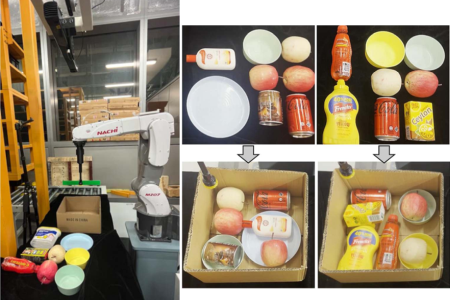








# About Me

I am currently a Ph.D. student at the Department of Computer Science and Engineering at the Chinese University of Hong Kong (CUHK), supervised by [Prof. Chi-Wing FU, Philip](https://www.cse.cuhk.edu.hk/~cwfu/). My research interests mainly focus on robotic manipulation and 3D visual perception. I received my Master’s degree at Sun Yat-sen University (SYSU), where I was supervised by [Prof. Wei-Shi Zheng](https://www.isee-ai.cn/~zhwshi/) and worked on video-based human action assessment. Before that, I completed my Bachelor’s degree also at Sun Yat-sen University (SYSU).

# News

- *2024.07*: &nbsp; One paper is accepted to ECCV 2024.
- *2024.03*: &nbsp; One paper is accepted to CVPR 2024.

# Selected Publications

**2024**
<!-- ######################################################### -->

**PPN-Pack: Placement Proposal Network for Efficient Robotic Bin Packing**

*IEEE Robotics and Automation Letters (**RA-L**), vol. 9, no. 6, pp. 5086-5093, 2024*

**Jia-Hui Pan**, Xiaojie Gao, Ka-Hei Hui, Shize Zhu, Yun-Hui Liu, Pheng-Ann Heng, and Chi-Wing Fu

[Paper](https://ieeexplore.ieee.org/document/10493124/) \| Video \| [Code](https://github.com/kwpoon/PPN-Pack) \| [BibTex](collections/2024_PPN_Pack/PPN_Pack.md) <strong></strong>

**2023**

<!-- ######################################################### -->

**SDF-Pack: Towards Compact Bin Packing with Signed-Distance-Field Minimization**

*IEEE/RSJ International Conference on Intelligent Robots and Systems (IROS) (**IROS**), 2023*

**Jia-Hui Pan**, Ka-Hei Hui, Xiaojie Gao, Shize Zhu, Yun-Hui Liu, Pheng-Ann Heng, and Chi-Wing Fu

[Paper](https://ieeexplore.ieee.org/stamp/stamp.jsp?arnumber=10341940) \| Video \| [Code](https://github.com/kwpoon/SDF-Pack) \| [BibTex](collections/2023_SDF_Pack/SDF_Pack.md) <strong></strong>

<!-- ######################################################### -->

**  **

*IEEE/CVF Computer Vision and Pattern Recognition Conference (**CVPR**), 2023*

**Hao Xu**, Tianyu Wang, Xiao Tang, Chi-Wing Fu

[Paper](https://ieeexplore.ieee.org/stamp/stamp.jsp?arnumber=9609694) \| [Code](https://github.com/Jia-Hui-Pan/Adaptive_Action_Assessment) \| [BibTex](collections/2023_H2ONet/H2ONet.md) <strong></strong>

**2022**

<!-- ######################################################### -->

**FINet: Dual Branches Feature Interaction for Partial-to-Partial Point Cloud Registration**

<!-- *Proceedings of the AAAI Conference on Artificial Intelligence (**AAAI**), 2022* -->
*The 36th Annual AAAI Conference on Artificial Intelligence (**AAAI**), 2022*

**Hao Xu**, Nianjin Ye, Guanghui Liu, Bing Zeng, Shuaicheng Liu

[Paper](https://ojs.aaai.org/index.php/AAAI/article/download/20189/19948) \| [Video](https://www.youtube.com/watch?v=XDmE9iSx9WM) \| [Code](https://github.com/hxwork/FINet_Pytorch) \| [BibTex](collections/2022_FINet/FINet.md) <strong></strong>

**2021**

<!-- ######################################################### -->

**OMNet: Learning Overlapping Mask for Partial-to-Partial Point Cloud Registration**

*IEEE/CVF International Conference on Computer Vision (**ICCV**), 2021*

**Hao Xu**, Shuaicheng Liu, Guangfu Wang, Guanghui Liu, Bing Zeng

[Paper](https://openaccess.thecvf.com/content/ICCV2021/papers/Xu_OMNet_Learning_Overlapping_Mask_for_Partial-to-Partial_Point_Cloud_Registration_ICCV_2021_paper.pdf) \| [Video](https://www.youtube.com/watch?v=u2lTKsom8oU) \| [Code](https://github.com/hxwork/OMNet_Pytorch) \| [BibTex](collections/2021_OMNet/OMNet.md) <strong></strong>

<!-- # Education

- *2022.08 - Present*, Ph.D. candidate, The Chinese University of Hong Kong (CUHK)
- *2019.09 - 2022.06*, M.Sc., University of Electronic Science and Technology of China (UESTC)
- *2015.09 - 2019.06*, B.E., Sichuan University (SCU) -->

<!-- # Experience

- *2018.12 - 2022.06*, Intern, Megvii Research -->

<!-- # Academic Services
- **Journals:** Signal Processing Letters (SPL); Computer Graphics Fourm (CGF)
- **Conferences:** AAAI; Pacific Graphics (PG); International Conference on Intelligent Robots and Systems (IROS) -->

<!-- # Projects

- *2018.12 - 2019.07, Driver Monitor System (DMS)*

Design a light-weighted end-to-end network running on an onboard chip to detect smoking, phoning, and drinking in driving.

       <video src='collections/DMS/DMS_smoke_demo1.mp4' controls="controls" width="30%" height="200px"></video>
       <video src='collections/DMS/DMS_smoke_demo2.mp4' controls="controls" width="30%" height="200px"></video>
       <video src='collections/DMS/DMS_phone_demo.mp4' controls="controls" width="30%" height="200px"></video>

- *2019.07 - 2020.03, NIO Gaze Estimation*

Design a light-weighted end-to-end network running on an onboard chip to estimate gaze and detect eye closure and occlusion at the same time.

       <video src='collections/Gaze/gaze_demo.mp4' controls="controls" width="30%" height="200px"></video>

 -->
