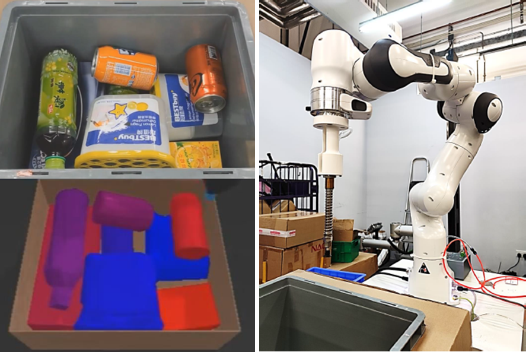








# About Me

I am currently a Ph.D. student at the Department of Computer Science and Engineering at the Chinese University of Hong Kong (CUHK), supervised by [Prof. Chi-Wing FU, Philip](https://www.cse.cuhk.edu.hk/~cwfu/). My research interests mainly focus on robotic manipulation and 3D visual perception. I received my Master’s degree and Bachelor’s degree at Sun Yat-sen University (SYSU), where I was supervised by [Prof. Wei-Shi Zheng](https://www.isee-ai.cn/~zhwshi/) and worked on video-based human action assessment.

# News

- *2024.03*: &nbsp; One paper is accepted to RA-L 2024.
- *2023.07*: &nbsp; One paper is accepted to IROS 2023.

# Selected Publications

**2024**
<!-- ######################################################### -->

**Embodiment-agnostic Action Planning via Object-Part Scene Flow**

*ArXiv, 2024*

Weiliang Tang, **Jia-Hui Pan**, Wei Zhan, Jianshu Zhou, Huaxiu Yao, Yun-Hui Liu, Masayoshi Tomizuka, Mingyu Ding, and Chi-Wing Fu

[Paper](https://arxiv.org/pdf/2409.10032) \| Video \| Code \| BibTex <strong></strong>

<!-- ######################################################### -->

**PPN-Pack: Placement Proposal Network for Efficient Robotic Bin Packing**

*IEEE Robotics and Automation Letters (**RA-L**), vol. 9, no. 6, pp. 5086-5093, 2024*

**Jia-Hui Pan**, Xiaojie Gao, Ka-Hei Hui, Shize Zhu, Yun-Hui Liu, Pheng-Ann Heng, and Chi-Wing Fu

[Paper](https://ieeexplore.ieee.org/document/10493124/) \| [Video](https://youtu.be/uy6tYh9-J4M) \| [Code](https://github.com/kwpoon/PPN-Pack) \| [BibTex](collections/2024_PPN_Pack/PPN_Pack.md) <strong></strong>

**2023**

<!-- ######################################################### -->

**SDF-Pack: Towards Compact Bin Packing with Signed-Distance-Field Minimization**

*IEEE/RSJ International Conference on Intelligent Robots and Systems (**IROS**), 2023*

**Jia-Hui Pan**, Ka-Hei Hui, Xiaojie Gao, Shize Zhu, Yun-Hui Liu, Pheng-Ann Heng, and Chi-Wing Fu

[Paper](https://ieeexplore.ieee.org/stamp/stamp.jsp?arnumber=10341940) \| [Video](https://youtu.be/HkjEjzviaCY) \| [Code](https://github.com/kwpoon/SDF-Pack) \| [BibTex](collections/2023_SDF_Pack/SDF_Pack.md) <strong></strong>

**2021**

<!-- ######################################################### -->

**Adaptive Action Assessment**

*IEEE Transactions on Pattern Analysis and Machine Intelligence (**TPAMI**), 2021*

**Jia-Hui Pan**, Jibin Gao, and Wei-Shi Zheng

[Paper](https://ieeexplore.ieee.org/stamp/stamp.jsp?arnumber=9609694) \| [Code](https://github.com/Jia-Hui-Pan/Adaptive_Action_Assessment) \| [BibTex](collections/2021_Adaptive_ASS/Adaptive_Ass.md) <strong></strong>

**2019**

<!-- ######################################################### -->

**Action assessment by joint relation graphs**

*IEEE/CVF International Conference on Computer Vision (**ICCV**), (Oral) 2019*

**Jia-Hui Pan**, Jibin Gao, and Wei-Shi Zheng

[Paper](https://openaccess.thecvf.com/content_ICCV_2019/papers/Pan_Action_Assessment_by_Joint_Relation_Graphs_ICCV_2019_paper.pdf) \| [Code](https://github.com/Jia-Hui-Pan/Adaptive_Action_Assessment) \| [BibTex](collections/2019_JRG_ASS/JRG_ASS.md) <strong></strong>

# Education

- *2021.08 ~ Present*, Ph.D. Student, The Chinese University of Hong Kong (CUHK)
- *2018.09 - 2021.06*, M.Phil., Sun Yat-sen University (SYSU)
- *2014.09 - 2018.06*, B.Sc., Sun Yat-sen University (SYSU)
